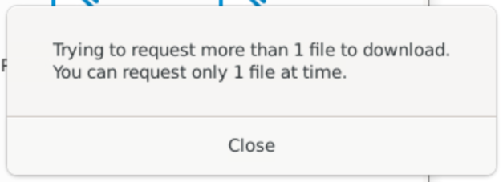

## Getting your results out {#getting-your-results-out}

You might be wondering "How do I get my results of my analytical code out into the world so they can be used in publications or other studies?"

### What is allowed out? {#what-is-allowed-out?}

Individual level data is not allowed out of the TRE. Any data out requests are reviewed by the Genes & Health core team to make sure they do not contain individual level data. Summary statistics, graphs etc are all usually fine. 

!!! info "TRE data export policy"
    For more information, please read the [TRE data export policy document](./TRE-data-export-policy-v2_5.pdf)

### Requesting data {#requesting-data}

You can make a request to download your results by right-clicking the file and selecting "request file download" for any file in:

```
/genesandhealth/red
```

or

```
/genesandhealth/pipeline
```

This sends an automated email to the Genes & Health team. If you have not received a response within 48h please feel free to chase us up. The team will copy the data to either `green` (for users of your sandbox only, to be able to download) or to `library-green` (for all users to be able to download). For small files, your data may be directly emailed (to the email address used to make the request).

!!! info
    Please note that you can make one data out request per week.

!!! tip
    If you are trying to download multiple files, please do not make a per-file download request.  Rather, create a tar archive containing the requested files.  If the files are large, you may wish to compress the tar file.

    For example, if you wanted to compress a folder into a .tar.gz file:

    ```
    tar -czvf backup.tar.gz /home/ivm/directory-of-files-to-export
    ```
    
    This says: “Create (c option) a gzip-compressed (z option) archive of my `directory-of-files-to-export` folder, show me what’s happening (v option), and name it (f option) `backup.tar.gz`.”  Please only use the compress option is your archive is large.

    See the [How to Tar a File in Linux: Commands, Examples & Best Practices](https://www.strongdm.com/blog/how-to-tar-a-file-in-linux) guide for more details (external unverified link) 

!!! Warning "'Trying to request more than 1 file to download.' error"
    
    
    
    If you get the 'Trying to request more than 1 file to download.' error, there is probably a space somewhere in your file path or filename.  This throws the systems so `/genesandhealth/red/Joe Blogs/my_requested_file.tar` (space in `Joe Bloggs` element of the path) or `/genesandhealth/red/Joe_Blogs/my requested file.tar` (spaces in `my requested file.tar`) will cause the error, but `/genesandhealth/red/Joe_Blogs/my_requested_file.tar` will not.  The current work-around is to rename your file and/or copy it into a path with no spaces.

### Existing data {#existing-data}

There are a number of files in `library-green` that are available for download. These do not need a request to be made.


## Accessing TRE data from external systems/internet {#accessing-tre-data-from-external-systems/internet}

Users can download data from `greendownloads` or `library-green` using linux command line [gcloud storage](https://cloud.google.com/storage/docs).

Alternatively, you can use the web-interface for your Sandbox specific `green-downloads` bucket, you can find the link for your sandbox using the table below:

| Sandbox | Link to green-downloads bucket |
| :---- | :---- |
| Sandbox 1 \- QMUL \+WSI Core Team Desktop | [https://console.cloud.google.com/storage/browser/qmul-production-sandbox-1\_greendownloads](https://console.cloud.google.com/storage/browser/qmul-production-sandbox-1_greendownloads) |
| Sandbox 2 \- External Academic Desktop | [https://console.cloud.google.com/storage/browser/qmul-production-sandbox-2\_greendownloads](https://console.cloud.google.com/storage/browser/qmul-production-sandbox-6_greenuploads) |
| Sandbox 3 \- GSK Desktop | [https://console.cloud.google.com/storage/browser/qmul-production-sandbox-3\_greendownloads](https://console.cloud.google.com/storage/browser/qmul-production-sandbox-6_greenuploads) |
| Sandbox 4 \- BMS Desktop | [https://console.cloud.google.com/storage/browser/qmul-production-sandbox-4\_greendownloads](https://console.cloud.google.com/storage/browser/qmul-production-sandbox-6_greenuploads) |
| Sandbox 5 \- MSD Desktop | [https://console.cloud.google.com/storage/browser/qmul-production-sandbox-5\_greendownloads](https://console.cloud.google.com/storage/browser/qmul-production-sandbox-6_greenuploads) |
| Sandbox 6 \- Takeda Desktop | [https://console.cloud.google.com/storage/browser/qmul-production-sandbox-6\_greendownloads](https://console.cloud.google.com/storage/browser/qmul-production-sandbox-6_greenuploads) |
| Sandbox 7 \- Pfizer Desktop | [https://console.cloud.google.com/storage/browser/qmul-production-sandbox-7\_greendownloads](https://console.cloud.google.com/storage/browser/qmul-production-sandbox-6_greenuploads) |
| Sandbox 8 \- S00050\_FFAIR-PRS Desktop | [https://console.cloud.google.com/storage/browser/qmul-production-sandbox-8\_greendownloads](https://console.cloud.google.com/storage/browser/qmul-production-sandbox-6_greenuploads) |
| Sandbox 9 \- Maze Therapeutics Desktop | [https://console.cloud.google.com/storage/browser/qmul-production-sandbox-9\_greendownloads](https://console.cloud.google.com/storage/browser/qmul-production-sandbox-6_greenuploads) |
| Sandbox 10 \- Novo Nordisk Desktop | [https://console.cloud.google.com/storage/browser/qmul-production-sandbox-10\_greendownloads](https://console.cloud.google.com/storage/browser/qmul-production-sandbox-6_greenuploads) |
| Sandbox  11 \- University of Exter | [https://console.cloud.google.com/storage/browser/qmul-production-sandbox-11\_greendownloads](https://console.cloud.google.com/storage/browser/qmul-production-sandbox-6_greenuploads) |
| Sandbox 13 \- AstraZeneca | [https://console.cloud.google.com/storage/browser/qmul-production-sandbox-13\_greendownloads](https://console.cloud.google.com/storage/browser/qmul-production-sandbox-6_greenuploads) |
| Sandbox 14 \- External Academic, Consortium access | [https://console.cloud.google.com/storage/browser/qmul-production-sandbox-14\_greendownloads](https://console.cloud.google.com/storage/browser/qmul-production-sandbox-6_greenuploads) |
| Sandbox 15 \- 5 Prime Sciences | [https://console.cloud.google.com/storage/browser/qmul-production-sandbox-15\_greendownloads](https://console.cloud.google.com/storage/browser/qmul-production-sandbox-6_greenuploads) |
| Sandbox 16 \- Sandbox 16 | [https://console.cloud.google.com/storage/browser/qmul-production-sandbox-16\_greendownloads](https://console.cloud.google.com/storage/browser/qmul-production-sandbox-6_greenuploads) |
| Sandbox 17 \- Academic, NHS Digital access | [https://console.cloud.google.com/storage/browser/qmul-production-sandbox-17\_greendownloads](https://console.cloud.google.com/storage/browser/qmul-production-sandbox-6_greenuploads) |

From your external system, ideally Linux server rather than laptop if you are downloading lots of data (e.g. our GWAS).

Login to gcloud with:

```
gcloud auth login
```

Login with your [username@genesandhealth.qmul.ac.uk](mailto:username@genesandhealth.qmul.ac.uk) that you use for TRE access from your browser. It is likely to ask you for 2 Factor Authentication either via phone or via a website link.

From a multicore Linux server, and especially if you are trying to transfer lots of data/files

```
gcloud storage buckets list gs://qmul-sandbox-production-library-green/
```

To transfer file use:

```
gcloud storage cp <local-file-path> gs://<bucket-name>/<destination-path> 
```
