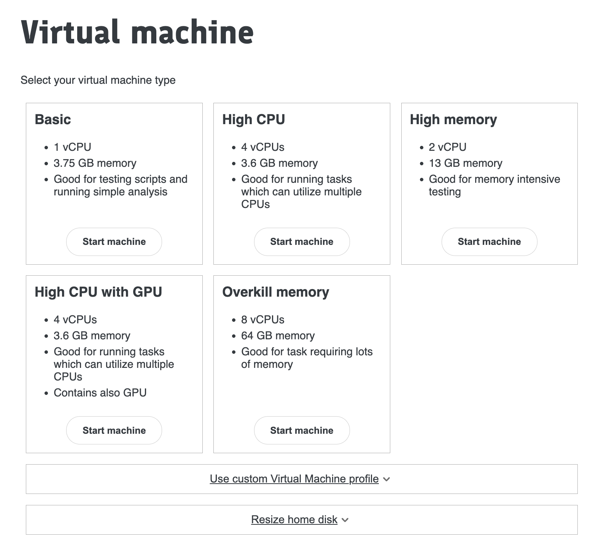
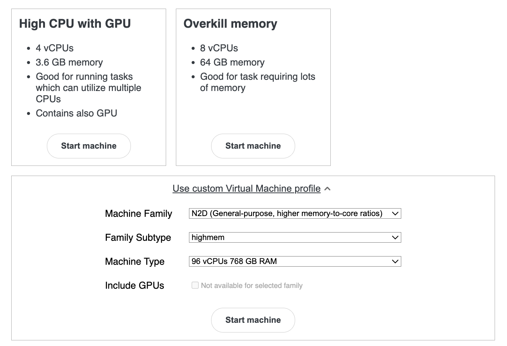

# Choosing your required virtual machine (VM) configuration

Once logged in, you will be taken to the **Virtual Machines** (VM) page where you can start a new machine or connect to an existing one.  

You will be offered a variety of virtual machine types.  

!!! warning
    Choose the `Basic` machine unless a script requires high memory or increased CPU capacity, and is ready to go. Test your script on the `Basic` machine first, as other options are more expensive.  

!!! note
    Some machine types have many CPUs, which are suitable for multithreaded applications like `plink` or `regenie` that can fully utilise them. These applications may sometimes run input/output operations too quickly for standard Google bucket storage, requiring you to copy key files to faster local storage (see [Understanding TRE folders and buckets](/docs/using-the-tre/folder-and-bucket-structure.md)).

## Choosing a custom machine configuration

It is possible you may require a Virtual Machine that offers resources different to the standard flavors i.e. higher-memory, higher-cpu or memory-optimised instances. You can choose a custom VM configuration from the **Virtual Machines** page by expanding the **Use custom Virtual Machine profile** section at the bottom.  

!!! warning
    Choose the **Use custom Virtual Machine profile only** when absolutely necessary. Excess use of higher-spec machines can significantly impact running costs.
