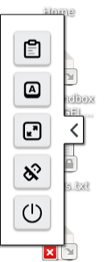

# Choosing your required virtual machine (VM) configuration

Once logged in, you will be taken to the **Virtual Machines** (VM) page where you can start a new machine or connect to an existing one.  

You will be offered a variety of virtual machine types.  

!!! warning
    Choose the `Basic` machine unless a script requires high memory or increased CPU capacity, and is ready to go. Test your script on the `Basic` machine first, as other options are more expensive.  

!!! note
    Some machine types have many CPUs, which are suitable for multithreaded applications like `plink` or `regenie` that can fully utilise them. These applications may sometimes run input/output operations too quickly for standard Google bucket storage, requiring you to copy key files to faster local storage (see [Understanding TRE folders and buckets](/docs/using-the-tre/folder-and-bucket-structure.md)).

## Choosing a custom machine configuration

It is possible you may require a Virtual Machine that offers resources different to the standard flavors i.e. higher-memory, higher-cpu or memory-optimised instances. You can choose a custom VM configuration from the **Virtual Machines** page by expanding the **Use custom Virtual Machine profile** section at the bottom.  

!!! warning
    Choose the **Use custom Virtual Machine profile only** when absolutely necessary. Excess use of higher-spec machines can significantly impact running costs.

## Switching off the machine

Your virtual machine will keep running for 24 hours if you are doing nothing. You can disconnect from Chrome or Firefox (the reccommended browsers for the TRE), turn your laptop off, and then you will be straight back into the exact same machine when you connect again (within 24h). If you have jobs running, the machine will keep going while these run (however long) plus another 48h.  
!!! warning
    Keeping machines running in the background costs money. So please actively shutdown (if you do not need the extra 48h) using the "Off" button on the bottom of the side menu or the `Shut down` option in the `Applications` menu.

### The 'Off' button in the TRE tools side tab

!!! tip
    You may need to click on the ">" chevron tab on the left of the TRE window to see this.

### The 'Shut down' option in the 'Applications' menu

The 'Applications' menu is in the top left of the TRE window, under the Genes & Health logo.

<!-- various attempts to control image pos and caption kept; none worked; kept to tweak anon -->

<!--
<figure>
    
    <figcaption>The 'Off' button in the TRE tools side tab.  You may need to click on the ">" chevron tab on the left of the TRE window to see this.</figcaption>
</figure>
-->

<!---

    
    <figcaption>The 'Off' button in the TRE tools side tab. You may need to click on the ">" chevron tab on the left of the TRE window to see this.</figcaption>
    
    <figcaption>The 'Shut down' option in the 'Applications' menu of the TRE.</figcaption>

-->

