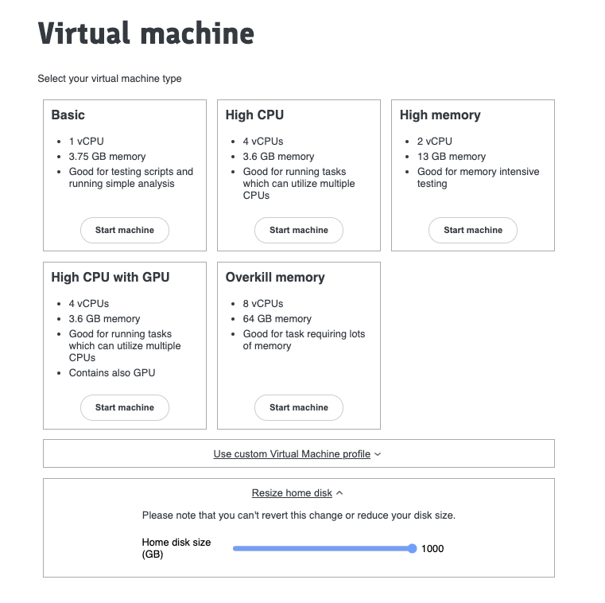

# How to increase your disk size {#how-to-increase-disk-size​}

By default, your `/home/ivm` directory's disk size is 100G. If you need to increase the disk size of your `/home/ivm` directory for any reason, you can do so from the **Virtual Machines** page.

1. Shutdown your VM if it is running.  
2. While creating a new VM from the **Virtual Machines** page, click on the **Resize home disk** section to expand it.

3. Use the slider to adjust the disk size according to your needs.  
4. Start the new VM with your preferred machine type.

The `/home/ivm` disk will be extended to the new size and previous data will be retained.

!!! info
    We recommend you store long-term data in the `red` bucket and we advise users not to treat the `/home/ivm` directory as their permanent storage location. Disk size can be increased upto 1000 GB.
    !!! warning
        Disk size changes are **permanent**, it is not possible to reduce your `/home/ivm` disk size back.  This may have implications for users who pay for their own Google Cloud usage.
