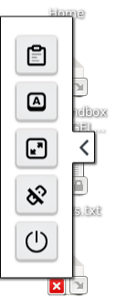
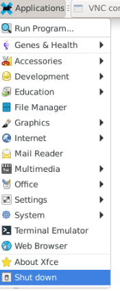

# Shutting down the TRE

Your virtual machine will keep running for 24 hours if you are doing nothing. You can close your TRE browser window, turn your laptop off, and then you will be straight back into the exact same machine when you connect again (within 24h). If you have jobs running, the machine will keep going while these run (however long) plus another 48h.  
!!! warning
    Keeping machines running in the background costs money. So please actively shutdown (if you do not need the extra 48h) using the "Off" button on the bottom of the side menu or the `Shut down` option in the `Applications` menu.

## The 'Off' button in the TRE tools side tab

!!! tip
    You may need to click on the ">" chevron tab on the left of the TRE window to see this.

## The 'Shut down' option in the 'Applications' menu

The 'Applications' menu is in the top left of the TRE window, under the Genes & Health logo.

<!-- various attempts to control image pos and caption kept; none worked; kept to tweak anon -->

<!--
<figure>
    
    <figcaption>The 'Off' button in the TRE tools side tab.  You may need to click on the ">" chevron tab on the left of the TRE window to see this.</figcaption>
</figure>
-->

<!---

    
    <figcaption>The 'Off' button in the TRE tools side tab. You may need to click on the ">" chevron tab on the left of the TRE window to see this.</figcaption>
    
    <figcaption>The 'Shut down' option in the 'Applications' menu of the TRE.</figcaption>

-->

