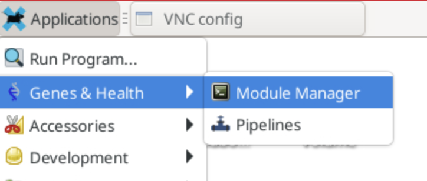
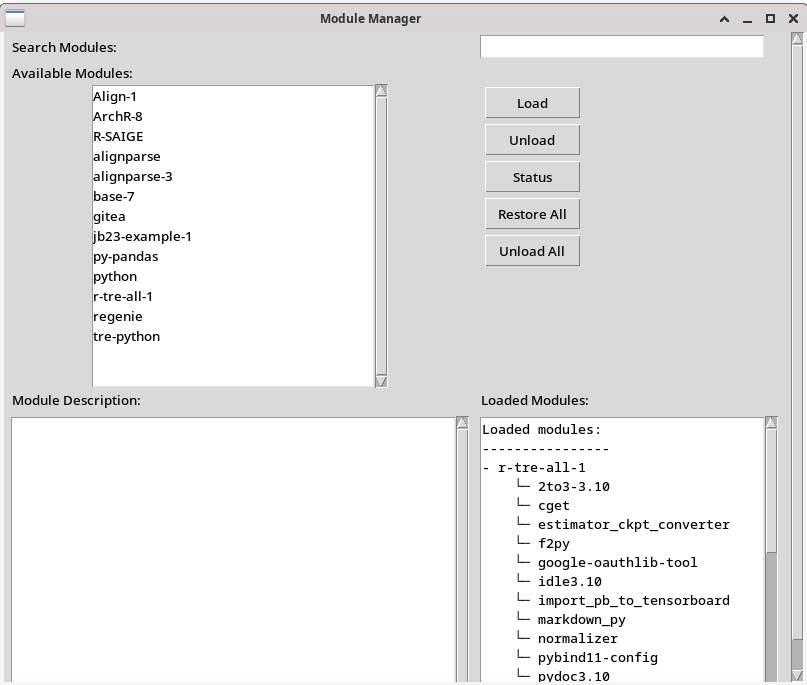
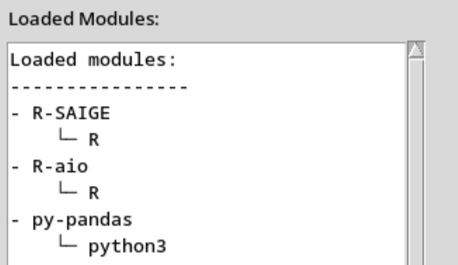
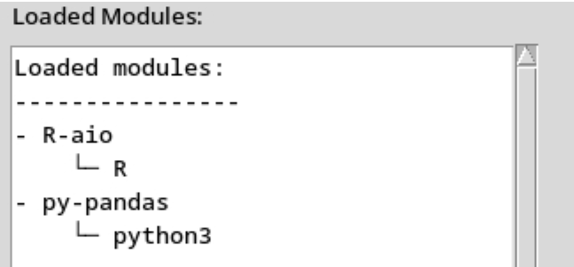

# Module Manager User Guide
Module Manager is a simple, user-friendly tool designed to help you manage Singularity-based software modules in your research or development environment.

This guide will walk you through how to load, unload, inspect, and restore software modules using both the command-line interface (CLI) and the graphical user interface (GUI).

## What Is a Module?
A module is a self-contained package that includes:

1. A Singularity container (singularity.sif) with the software
2. A meta.yaml file describing:
    - What commands the module provides
    - What packages are inside

Loading a module makes its commands available in your terminal — no need to deal with paths or environment variables. 

For example, if you load a module r-ggplot, this will expose a R command in your terminal (replacing the default R command). When you run the R command from your terminal, the R environment from that module/container will effectively be in use and any bundled packages in the container are available. From the user's perspective, it works similar to using native R installation.

## Getting Started
You can interact with the Module Manager in two ways:

1. Terminal (CLI): For users who prefer scripting or command lines.
2. Graphical Interface (GUI): Simplest, for those who want a more intuitive, click-friendly experience.

## GUI Usage
You can find the ‘Module Manager’ application icon on your desktop. You can also find it from the top-left drop-down menu (Applications >> Genes & Health):

Once you have launched the application, the interface will look like this:

**Search Modules (Top):** Use the search bar to filter modules by name. You can start typing keywords in the search bar to find available packages.

**Available Modules (Left Panel):** Displays a list of all the available modules.

**Module Description (Bottom Left Panel):** When you click on a module from the ‘Available Modules’ panel, a module description will appear in this panel. The description will usually include following information:
    - A general description of the module and its intent.
    - Packages Included: A list of packages installed and available in the module.
    - Commands Exported: A list of commands that the module will expose to the user terminal.

**Loaded Modules (Bottom Right Panel):** Shows a list of the loaded modules along with the commands they expose.

### Actions:
**Load:** Once you have selected a module from the ‘Available Modules’ panel, you can click the Load button to make the module's commands available in your shell. The loaded modules will now be shown in the ‘Loaded Modules’ panel at the bottom right along with the list of commands they expose.

**Unload:** After selecting a module from the ‘Available Modules’ panel, you can click on the Unload button to remove a module and its commands from your shell.

**Status:** Check if a module is loaded, and view its details.

**Restore:** Re-load all previously active modules (e.g., after a reboot).

**Unload All:** Remove all active modules in one click.

!!! Note
    The modules in the ‘Loaded Modules’ panel appear in the LIFO order. If two loaded modules expose the same command (e.g. R), only the top-most (latest loaded) module is active and is available in the user terminal.

In the following example, both R-SAIGE and R-aio expose the R command to the user terminal. However, as the R-SAIGE is the latest one (at top of the list), this is the effective module and typing the R command will load this module’s R environment.

Once you have unloaded the last loaded module that exposes R (R-SAIGE), the previously loaded module (R-aio) will become active and now the R command from the terminal will point to the R-aio:

## CLI Usage
If you're comfortable in the terminal, the module-manager CLI tool gives you precise control.
### 1. Load a Module
'''module-manager load [module-name]'''

- Checks if the module is already loaded.
- Creates lightweight command wrappers in ~/.local/share/modules/bin/
- Lets you run module commands directly in your terminal.

**Example:**
module-manager load bcftools

Now you can simply run:
bcftools view file.vcf

Under the hood, this command is being executed inside the corresponding Singularity container.

### 2. Unload a Module
module-manager unload <module-name>

Removes the command wrappers for the module
Updates your "loaded modules" list

**Example:**
module-manager unload bcftools

### 3. Restore All Modules
module-manager restore

Use this after a logout/reboot to restore all previously loaded modules. Most of the time this won’t be needed, as Module Manager preserves last state.

### 4. List Available Modules
module-manager list-available

Shows all available modules.

### 5. List Currently Loaded Modules
module-manager list-loaded

Displays all modules you've loaded, along with the commands they expose.

### 6. Check Module Status
module-manager status <module-name>

Gives a detailed view of:
  - Whether the module exists
  - Whether it's loaded
  - Which commands are available

### 7. Unload All Modules
module-manager unload-all

Removes all active modules and their command wrappers.

# Frequently Asked Questions
### Where do my modules come from?
They live in /genesandhealth/library-red/modules. Your admin or team lead might maintain these.
Tips
You can load multiple modules at once. They won't interfere with each other unless they export the same command names. 

Use status before loading or unloading a module to see what's going on.

# Need Help?
If you're facing issues or want to request a new module, contact your TRE system administrator or support team **(hgi@sanger.ac.uk)**.
