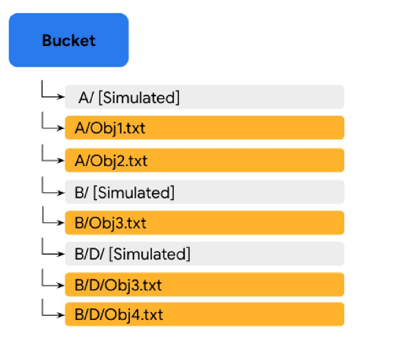
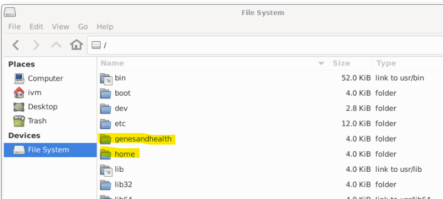
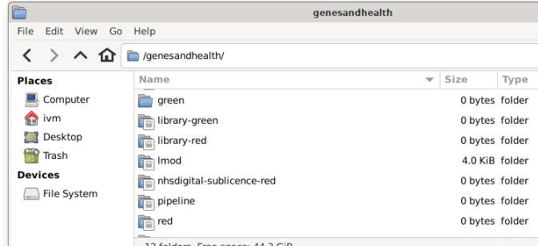

# Folder and bucket structure

To undertand how Genes & Health data are stored and how to use the data resources, we need to understand **Google Cloud Storage (GCS) buckets**.  GCS buckets are used for all data storage in the TRE with the exception of user data in the `home` directory.

!!! note "`home` directory"
    The `home` directory is associated with the Gene & Health virtual machines rather than GCS --so it is (and behaves as) a standard unix directory.  Files and directories in `home` are created, manipulated and deleted as in Unix/Linux.  Strictly speaking, your `home` directory is a sub-directory of `home`: `/home/ivm` --you have read/write access to `/home/ivm` but read only to `/home`
    !!! success "`home` directory persistence"
    The `home` directory is persistent --when you close a virtual machine, the home direcotry will not be deleted and will present the same way next time you spin a new virtual machine --regardless of the configuration of the new VM.  Although the `home` directory is persistent, its use is recommended only for development purposes; we advise ensuring critical code and data are regularly copied to the `red` folder.

## Understanding Google Cloud Storage (GCS) buckets

Genes & Health TRE data are stored in Google Cloud Storage (GCS) buckets (on a server located in London, UK). Buckets are the basic data container for GCS and everything stored in GCS must be contained in a bucket.

Each of the G&H TRE top level storage domains are separate GCS buckets, for example, `library-red`, `red`, `green` and `exomes-library-red`. Files in a G&H TRE bucket are just that. The bucket contains a collection of files.

### GCS buckets and directories

The concept of a physical directory does not rightly exist in GCS. Rather, directories are “simulated” by GCS from the files name. This can be illustrated as follows:  



In the image above, the filenames are `A/Obj1.txt`, `A/Obj2.txt`, `B/Obj3.txt`, `B/D/Obj3.txt` and `B/D/Obj4.txt` and the files simply exists a files in the bucket with those filenames. Bucket folders `A/`, `B/` its sub-folder `D/` are simulated. This means that if you were to delete `A/Obj1.txt` and `A/Obj2.txt`, the simulated folder `A/` would disappear (there would no longer be any files justifying its existence). However, if you were to delete file `B/Obj3.txt`, both simulated folder `B/` its sub-folder `D/` would remains as they would be accounted for by filenames `B/D/Obj3.txt` and `B/D/Obj4.txt`.

If you were to delete all the .txt files in the bucket, all of the directories would disappear but the bucket would remain in existance.

## G&H's `root` directory (`/`)

The G&H data buckets reside in the `genesandhealth` folder of the VM's root directory (`/`).  The `home` directory also resides within the VM's root directory.  

!!! warning
    Other directories under the VM's root directory are system, software and VM related folders and not of use to TRE users.



## G&H data buckets

G&H data buckets can be found in the `/genesandhealth` directory.  Depending on your sandbox, you will see different buckets (essentially behaving as directories) in your `/genesandhealth` directory 

G&H buckets are named `red` and `green` or suffixed with `-red` or `-green` to indicate the type of data stored in them: `red` is for potentially sensitive data that **should not be shared outside your sandbox**; `green` is for data that can be shared with the outside world. When you log into your sandbox, your VM will have a number of buckets available for you.  Here are some of the buckets (top level "directories") in the G&H sandbox-1 TRE:



There are two fundametal buckets in the G&E TRE: `library-red` and `red`.


### Identifying G&H GCS buckets

G&H buckets can be identified into two way within the TRE --depending on the file operation you may need to use one or the other method of identifying the bucket:
1. As a path on the virtual machine (e.g. (`/genesandhealth/red/`)
2. As a Google Cloud Storage bucket identified by a Uniform Rseource Locator (URL), for example `gs://qmul-production-sandbox-1-red/` identifies the `red` bucket on sanddox-1.

The bucket's URL will depend on the sandbox you use.  

This [reference page](#folder-structures) goes through the other folders and explains what they are for and how they should be used. The following is a high-level overview of the directories in the TRE:  


<!--Folders are suffixed with red or green to indicate the type of data that is stored there. Red is for potentially sensitive data that should not be shared outside. Green is for data that can be shared with the outside world. When you log into your sandboxes, you will have a number of folders available for you. -->
To get started, we will concentrate on the `library-red`, `red`, and `home` folders but before we do so, we


#### The `library-red` bucket

Available at `library-red` \[give full path\] in your sandbox, this is a read-only folder that is shared between all users. It contains the data you need for your analyses. **library-red** is slower storage of large capacity (\>8 PiB as of February). For large files, the entire file must be read and cached first by gcsfuse; direct file seeking to a specific part of the file is not possible.  

For high-performance or large files, it may be better to make a copy to **red** or **home/ivm**. **library-red** corresponds to the Google Storage bucket **gs://qmul-sandbox-production-library-red/** (read-write access only for admins). **library-red** stores curated and raw data necessary for your analysis. This is where you will find the data you need to run your analysis. It includes several subfolders, each designated for specific data types and purposes. If you find a folder without a `readme` file, please contact the Genes and Health team for more information on its intended use.

#### The `green` bucket

PLACEHOLDER.

#### The `red` bucket

On the TRE, /red/ “lives” on the file system (/genesandhealth/red/) as shown below:  


Physically though, as the /red/ bucket is stored on a Google Cloud file server, it has a Uniform Resource Locator (URL). The URL will depend on the sandbox you use.  
For sandbox-1, the URL is gs://qmul-production-sandbox-1-red/ and, predictably, you need to change the number in the URL to match your sandbox number. When moving things to and from the red bucket using either gcloud (Option 2\) or file mounting (Option 3), you will need to use the URL.

The `red` bucket is a read-write bucket for TRE users to store scripts and data safely (with versioning back-up) and to permit the sharing of these between project collaborators. It is the only GCS bucket **directly** accessible to non-admin TRE users. 

## Moving TRE data

TRE user have two data storage resources available to them: i) their virtual machine `home` directory (`/home/ivm`), ii) the `red` GCS bucket.  Users therefore need to be able to perform one of three file handling operations:

1. Copying data from `library-red` or `red` to `/home/ivm`
2. Copying data from `/home/ivm` to `red`
3. Deleting data from `red`

!!! note
    Users may also wish to move/copy/rename/delete files and directories within `/home/ivm/` however, as prevously stated `home` behaves as a standard unix/linux filesystem and therefore standard unix `mv`, `cp`, `rm`, `rmdir` commands can be used for file manipulation.  

The three ways to manipulate folders and files in the red bucket are:

1. using the “Upload to red bucket” option in the File Manager,  
2. using the gcloud command line interface,  
3. mounting your red folder into your virtual machine.

### Copying data to red

Once you have located the file/folder you want to copy into red, right click on that object and select “Upload to red bucket”:


A new window will then pop-up allowing you to select where in red you want this data to go (“red” is the top directory in red so it’s recommended you navigate to a personal or project red directory before selecting “OK”):  


* You can use the “Browse” button to find and select existing directories in red.

* If you select the “Create New Folder” button, it will prompt you for a name, and then create a new folder in the location currently selected.

* Selecting “OK” will begin the copying process into the directory chosen and you will see a new window documenting the outcome, for example:   
    


## Folder structures

### consortiumpriorityperiod-library-red

This bucket is only available to the core Genes & Health team, and to companies in the Genes & Health Industry Consortium. It contains data restricted during 9 month priority access periods (e.g. exome sequencing). Specifically, read access is only for sandboxes 1 3 4 5 6 7 9 10 13\.

Same storage type as **/genesandhealth/library-red**, see comments above

**/genesandhealth/consortiumpriorityperiod-library-red** is a google storage bucket **gs://qmul-sandbox-production-library-consortiumpriorityperiod-red** (read+write only for admins)

### Green folders

#### **green**

Specific to each sandbox.

green can be read by other users in the sandbox. Users cannot write to green.

Users can download from **/genesandhealth/green** from internet/external systems.

The admin team will review data out requests, and either place the data in green (for specific users to download, short term) or **library-green** (long term availability for all users to download).

**Data in each sandbox green will be deleted approx 1 week after creation. green is not intended for long term storage, only data transfer/download.**

Same storage type as **/genesandhealth/library-red**, see comments above.

**/genesandhealth/green** is a google bucket **gs://fg-qmul-production-sandbox-1\_green/** (read only for users, read+write only for admins) (replace the 1 with whichever sandbox you want)

#### **consortiumpriorityperiod-library-green**

Access as for **consortiumpriorityperiod-library-red** but with external download (e.g. gsutil) enabled. Used for results. Not for individual level data.

```
gs://qmul-sandbox-production-library-consortiumpriorityperiod-green
```

### Other folders

#### **shared**

You can 'publish' a file to /genesandhealth/shared by right clicking on it, and selected 'Share with all users'

/genesandhealth/shared is available to all other users within the TRE.

#### **pipelines**

This is the output of the high performance compute WDL Pipelines, that the ivm/pipeline writes to. Users of the sandbox have read only access.

Specific to each sandbox.

This is slower storage of large capacity (\>8 PiB @ Feb 2022\)

#### **Public datasets bucket**

We also maintain a bucket for public datasets. This is not visible from within the TRE. Much of the data is mirrored in genesandhealth/library-green/ within the TRE.

```
gs://genesandhealth\_publicdatasets/
```

### Copying between Google Buckets within the TRE

Is permitted from within the TRE, subject to user read/write permissions as above.

Admins may copy from Google Buckets to external systems. However external copy from external Google Buckets direct to/from TRE Google Buckets is prohibited for security reasons.

### Backups

Data in selected folders is protected from accidental deletion or alteration by the Google Object Versioning service. Specifically, for data in these folders \-

#### **Shared folders**

/genesandhealth/library-red , 1 version, 30 days

/genesandhealth/consortiumpriorityperiod-library-red, 1 version, 30 days

/genesandhealth/nhsdigital-sublicence-red, 1 version, 30 days

#### **Sandbox-specific folders**

/genesandhealth/red, 2 versions, 30 days

/genesandhealth/pipeline, 1 version, 7 days

We will keep either a) the prior version of the data prior to a change (or deletion) by a user for 30 days , or b) two prior versions of the data prior to a change (or deletion) by a user for 30 days.

This allows the prior version to be restored, in the event of accidental erasure or deletion.

To say this another way: imagine you accidentally alter or delete a file in the /genesandhealth/library-red folder. Then the version of the file prior to its removal can be restored, for up to 30 days after the change. In the sandbox-specific /genesandhealth/red folder, two prior versions of the file will be kept, each for 30 days after the change leading to its creation.

Restoring a prior version of an accidentally removed or modified file requires utilities only available to administrators: if you need this, contact us using Slack or writing to hgi@sanger.ac.uk, including the word "Urgent" in the subject header.
