# Handling files and folders

There are four main scenarios to consider when using files and folders in the G&H TRE:

1. Moving files or folders from a GCS bucket to your `home` directory
2. Moving files or folder from you `home` directory to the `red` GCS bucket
3. Creating/renaming/moving/deleting files and folders in the `red` GCS bucket
4. Creating/renaming/moving/deleting files and folders your `home` directory

All operations mentioned in items 1, 2 and 3 above can be completed using `gcloud storage` commands.  All operations in item 4 can be performed using standard unix/linux shell commands (e.g. `cp`, `mv`, `rm`, `mkdir`) or the File Manager GUI.

!!! tip "Reminders"
    * Google Cloud Services (GCS) buckets are explained in the ["Understanding TRE folders and buckets"](./folder-and-bucket-structure.md) section.
    * `library-red` is a read-only bucket for TRE users, you cannot add to it or make any changes to it.
    * Your `home` directory "belongs" to the virtual machine.  It behaves like a standar unix/linux files system. Its actual path is **`/home/ivm/`**. 

## Google Cloud Services’ `gcloud storage`

### What is `gcloud`?

`gcloud` is the Google Cloud Services' Command Line Interface (CLI): a set of tools to create and manage Google Cloud resources.  `gcloud` has multiple GROUPS which handle a specific aspect of the Google Cloud.  For example, `gcloud sql` handles the creation and management of Google Cloud SQL databases and `gcloud source` handles cloud git repository commands.

The only gcloud GROUP of relevance to the G&H TRE is the `storage` group.  `gcloud storage` handles the creation and management of Cloud Storage buckets and objects (files).

`gcloud storage` documentation can be found on [`gcloud storage` reference website](https://cloud.google.com/sdk/gcloud/reference/storage).

!!! danger "What if I’m using `gutils`?"
    Some of you may have been using `gutils` to manage Cloud Storage buckets and objects.  The `gutils` commands are now **deprecated**.
    <p>
    ⚠️ BE CAREFUL:
    
    * Google states: "Important: `gsutil` is not the recommended CLI for Cloud Storage. Use `gcloud storage` commands in the Google Cloud CLI instead."
    * We advise you against using of `gutils`.  The `gsutil` tool does not support working with newer Google Cloud Storage’s features such as soft delete.  This means that `gsutil` removes all versions of a file, whereas `gcloud storage` only removes the latest version.
    * We have bucket versioning switched on in sandboxes as part of the backup strategy (so we can recover an old version of a file for users).  If you delete with `gutils`, we may not be able to recover the file(s).
    !!! tip "TL:DR"
        **Don't use `gutils`**
        
### Fundamental `gcloud storage` operations

!!! info "Reminder"
    You need to identify GCS buckets using their Uniform Resource Locator (URL), for example, the URL for the `red` bucket on sandbox-1 is: `gs://qmul-production-sandbox-1-red/`.  URLs for G&H TRE buckets are given in the ["What's in the bucket?"](./understanding-tre-folders-and-buckets.md#whats-in-the-bucket) section.

!!! warning "Warning"
    `gcloud storage` can replicate common linux file and directory handling commands.
    
    * These commands are powerful, you could easily accidentally delete entire directories or rewrite files.
    * Do read the [`gcloud storage` documentation](https://cloud.google.com/sdk/gcloud/reference/storage).
    * Consider backing up data before uploading or downloading it to/from a google bucket
    * Favour copying over moving (at least one copy of your files should remain)
    * Understand that the gcloud storage copy and move operations are **non-atomic**.  This means it is not an all or nothing (completes or doesn’t complete) command; rather, it performs a copy from source to destination followed by, for move operations, deleting the each source object.  If the command does not complete, you may end up with some files copied/moved/renamed and others not.
    * A consequence of this is that, in addition to normal network and operation charges, if you move a Nearline Storage, Coldline Storage, or Archive Storage object, deletion and data retrieval charges apply.

#### Creating a new directory (in `red`)

If you want to create a new directory in `red`, you must upload one into it. Remember that the concept of a directory does not rightly exist in Google cloud buckets.  Google bucket store files.  This means that you cannot just upload an empty directory into the `red` bucket.  If you try to do so, you will get the following error:

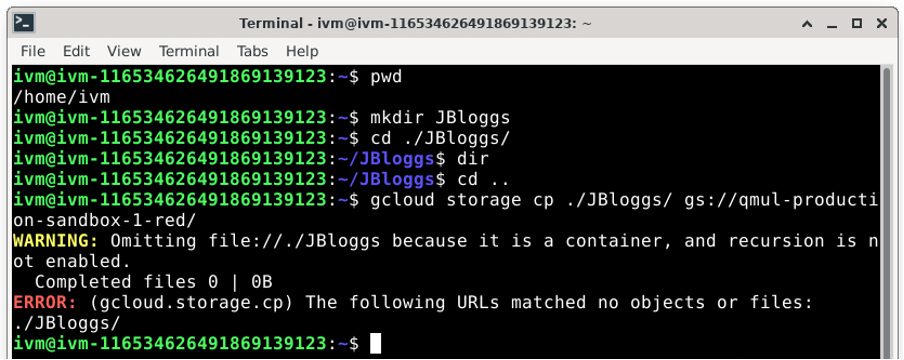

To successfully create a new directory or directory branch in `red` with `gcloud storage` you simply need to copy (or move) a file to the `red` bucket.  The simplest is often to create an empty file using the linux `touch` command.


Now copy this empty file using:
```
gcloud storage cp [dummy_file] [destination/on/red/bucket/]
```
So for example:


Do not forget to end the destination location with a `/` (forward-slash).  If you do not, you will copy `temp.txt` into a file called `JoeBloggs` on the `red` folder. 

You could also simply move the file using:
```
gcloud storage mv [dummy_file] [destination/on/red/bucket/]
```

You can create further subdirectories by specifying them in the destination location.  For example, if you wanted to create `/red/JoeBloggs/Data/GWAS_data/Jan2024`, you would do the following:


You now have created all the (virtual) sub-directories along the way:

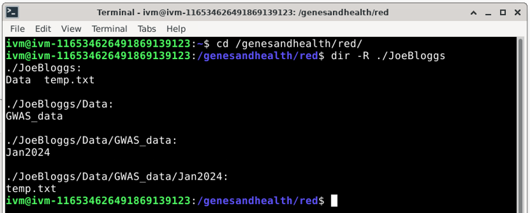

Please note that this will only upload new files or directories (as long as they contain at least one file or non-empty subdirectory) to the `red` bucket. Pre-existing files in `red` will not be affected.  For example, you can see that the `temp.txt` file we created in `/red/JoeBloggs/` when we used the `gcloud storage cp ./temp.txt gs://qmul-production-sandbox-1-red/JoeBloggs/` command is still there.  However, if you delete all files in a `red` bucket directory, you will also delete the virtual directory they are in.  

In the example above, if you delete `/red/JoeBloggs/Data/GWAS_data/Jan2024/temp.txt`, you will lose directories `Jan2024`, `GWAS_data` and `Data` because all of these would end up empty.

#### Listing all buckets and files: `ls` command

```bash
gcloud storage ls [PATH …]
```

You can use wildcards to match multiple paths, e.g.

```bash
gcloud storage ls gs://qmul-production-sandbox-1-red/JoeBloggs/Data/GWAS_Data/Jan*/*.csv
```

This will list all `.csv` files in any directory in `GWAS_Data` which starts with `Jan` (e.g. `Jan2022`, `Jan2023`, `Jan2024`).

---

#### Uploading, downloading, and copying

The general format is:

```bash
gcloud storage cp [SOURCE …] DESTINATION
```

We have seen how to upload files to Google Cloud with `cp` above when learning how to create a directory.

---

##### Copying an entire directory tree (i.e., directory, subdirectory, and all its content)

Use the `--recursive` option to copy an entire directory tree. The following command “uploads” the directory tree `dir` to the red directory:

```bash
gcloud storage cp --recursive dir gs://qmul-production-sandbox-1-red
```

##### Copying to your current (local) directory

In this example, the command will copy (“download”) all `.txt` files in `JoeBloggs` to your current local directory:

```bash
gcloud storage cp gs://qmul-production-sandbox-1-red/JoeBloggs/*.txt .
```

\[Don’t forget the `.` at the end.\]

#### Moving and renaming

The general template is:

```bash
gcloud storage mv [SOURCE …] DESTINATION
```

##### Moving all objects from a local directory to a bucket

```bash
gcloud storage mv ./dir gs://qmul-production-sandbox-1-red/JoeBloggs/
```

Note: All files will be moved from `./dir` to `/JoeBloggs/` (so will no longer be in `./dir`) but the `./dir` and any subdirectories in it will remain in the local directory.

##### Moving all objects from a bucket to a local directory

```bash
gcloud storage mv gs://qmul-production-sandbox-1-red/JoeBloggs/* dir
```

##### Renaming a file

```bash
gcloud storage mv gs://qmul-production-sandbox-1-red/JoeBloggs/old_name.txt gs://qmul-production-sandbox-1-red/JoeBloggs/new_name.txt
```

\[Remember `old_name.txt` will be copied to `new_name.txt` and then `old_name.txt` will be deleted; if `old_name.txt` is very large, this may incur data charges.\]


## Alternative to `gcloud storage`: 1. the “Upload to red bucket” option in the File Manager

### Uploading a file to `red`
To upload a file to `red` from another location (here my home folder on ivm), right click on the file and select “Upload to red bucket”.

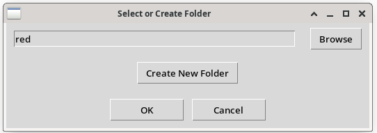

A new window should pop-up documenting the outcome, for example:
    
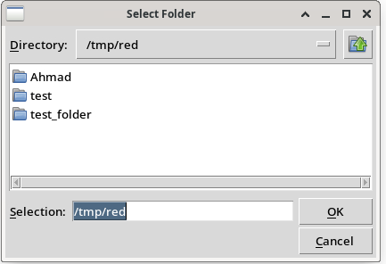

However, this will upload to file to the top directory in `red`.  This is not recommended.  Rather you should upload your files into your personal or project `red` directory.

### Creating a new directory in `red`
    
If you want to create a new directory in `red`, you must upload one into it.  Remember that a GCS simulated directory can only exists if it is accounted for by a file.  If you try to upload an empty directory from a different location to `red`, you will get the following error:
    
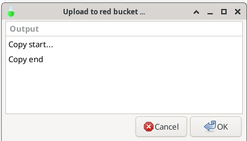

Your directory must contain at least one file to be uploaded to the `red` bucket.

To create a new directory in `red`, first create an identically named directory in /home/ivm/ using one of the two methods below:

**Method 1:** Creating a new directory and file in File Manager

To create a directory and file to upload to `red` in File Manager, right-click in empty space and select “Create New Folder”, then enter your folder name and click ‘OK’.

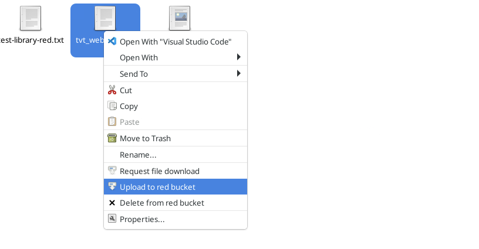

Now enter the new folder, right-click in empty space and select “Create Document / Empty File”


Give the file whatever name you want and click “Create”

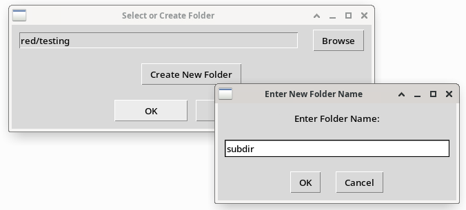

You now have a folder called `JoeBloggs` which contains an (empty) file called `JB_dummy_file.txt`.

**Method 2:** Creating a new directory and file in Terminal

To create a new directory using the Terminal, first create a directory using the `mkdir` command, enter the directory with the `cd` command and create an empty file in this directory with the `touch` command as illustrated below.

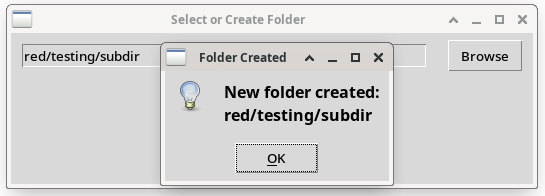

Using either of the methods above, you should end up with the following directory on /home/ivm/:


Now navigate back to the `JoeBloggs` directory, right-click on the directory icon and select “Upload to red bucket”.


The `red` bucket now contains a (virtual) directory called `JoeBloggs` with the (empty) file `JB_dummy_file.txt`:


> ⚠️ BE CAREFUL, if you delete all files in a `red` bucket directory, you will also delete the virtual directory.  In this case, if you delete `JB_dummy_file.txt`, the `JoeBloggs` directory will disappear.

### Creating a sub-directory in the `red` bucket

To create a sub-directory in the `red` bucket, you need to create an identical directory tree in `/home/ivm/` (or another drive allowing this) and upload this to `red`.
For example, suppose we wanted to create a JoeBloggs sub-directory called ‘JB_data_dir’ we would do the following:


And then navigate to the JoeBloggs directory in `/home/ivm/` and right-click “Upload to red bucket”:


You now have the (virtual) directory structure `/red/JoeBloggs/JB_data_dir/` in `red` with the file `JB_data_dir_dummy.txt` in the directory.

!!! info
    * this will upload any new file or directory in the /home/ivm/JoeBloggs/ directory, for example, if you added “v_large_temp_file_that_should_definitely_not_be_moved.gz” in the /home/ivm/JoeBloggs/ directory, this will be uploaded to `red`
    * the “Upload to red bucket” option will not replicate your /home/ivm/JoeBloggs/ directory to `red`, it will only upload new files or directories (as long as they contain at least one file) to the `red` bucket. For instance, if you delete `/home/ivm /JoeBloggs/JB_data_dir/` and then select “Upload to red bucket” for `/home/ivm /JoeBloggs/`, there will still be a `/red/JoeBloggs/JB_data_dir/` directory.

### Moving or renaming data in the `red` bucket

This is only possible using `gcloud storage`.

## Alternative to `gcloud storage`: 2. Mounting the `red` bucket onto your VM

The `red` directory is currently available to the G&H virtual machines as read-only and lacks some user permissions. The ability to upload files to a specific sub-directory, moving/editing files directly inside the `red` bucket, and creating a new directory inside `red` by using a terminal requires the use of the “tricks” described in Option 1 or the use of `gcloud storage` commands.  

Currently, there is no other GCS space available as read/write. There are on-going discussions with the developers of TRE to make the use of buckets easier for collaboration and sharing and this will hopefully be improved in the future.  
As an alternative, you can mount a specific directory from `red` in your `home` directory.  

### What is mounting?

Mounting is a process by which a computer's (or in our case, a virtual machine’s) operating system makes files and directories on a storage device (such as hard drive, CD-ROM, or network shared drive) available for users to access via the computer's file system.  
When you mount a GCS bucket directory onto virtual machine, you are essentially creating a mirror of the GCS bucket. However, you can handle this locally created mirror (i.e. the mounted directory) as a “normal” linux directory.  

!!! warning "Be careful..."  
    * Any change you make to the locally mounted directory will be replicated (mirrored) in the GCS bucket.
    * Likewise, if you were to make changes directly in the GCS bucket, these would be replicated (mirrored) in the locally mounted directory.  

### How to mount a `red` directory to your VM?

Create a directory in your home directory with:  

```bash
mkdir /home/ivm/[dir-name]
```

(Replace the `[dir-name]` with a directory name of your choice.)  

Run the following command to mount a shared team directory from red to `/home/ivm/[dir-name]`:  

```bash
gcsfuse --implicit-dirs "$SANDBOX_PROJECT-red" --only-dir 'MY_TEAM_DIRECTORY' /home/ivm/[dir-name]
```

!!! success "Note"  
    * All on a single line
    * You must use double-quote (`"`) around `$SANDBOX_PROJECT-red`
    * Replace `MY_TEAM_DIRECTORY` with the name of a directory in `red`
    * You will need to repeat the `gcsfuse` command on each reboot of your Virtual Machine, as it won't persist.  

All the members of your team should be able to run this command to have the same shared files in the `/home/ivm/[dir-name]` directory.  

#### Mounting: illustrated example


Creates a new (empty) directory on `/home/ivm`:  


The equivalent directory on `red` is not empty (it contains several files and sub and sub-sub directories):  


Now mount `red`’s `JoeBloggs` locally:  


Which tells us:  


Now look at `/home/ivm/JoeBloggs`: 


All the files, directories, sub and sub-sub directories from `red`’s `JoeBloggs` are mirrored.  
But `/home/ivm/JoeBloggs/` “behaves” like any linux directory:  

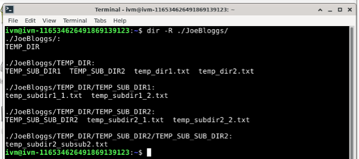

You can add files in any of these various directories:  


And they appear on the locally mounted `JoeBloggs`:  


And  


But they also appear in the `red` GCS bucket!  


And


!!! info
    You may have to click the refresh circular arrow in the top right corner to see the changes.
    

If you delete a file in the GCS red bucket:  

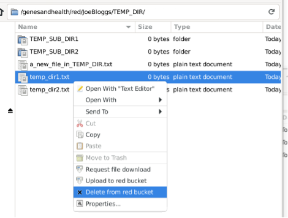

The file will also be deleted from the locally mounted mirror:


Likewise, if you delete a file in the locally mounted mirror:  

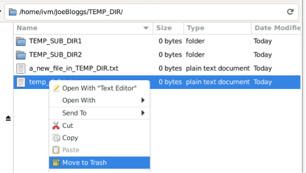

The file will also be deleted from the red GCS bucket:


