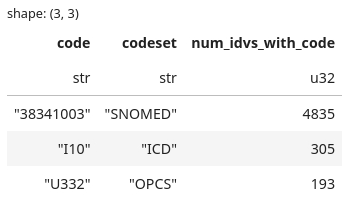

# Bespoke binary phenotypes

At present, Genes & Heatlh provides a curated set of 285 custom-defined binary phenotypes as detailed in the "Phenotype curation" section (we also provide 'First Occurrence of 3digitICD10' in the style of UK Biobank).

We are aware that TRE users sometimes wish to use bespoke phenotypes based on their own curated codelist(s).  We are currently developing this facility but in the interim, users wishing to identify a list of G&H volunteers matchig their codelist(s) can do so using intermediary files generated by the [BI_PY pipeline](https://github.com/genes-and-health/BI_PY/){target="_blank"}.   

## SNOMED, ICD-10, OPCS data

G&H volunteers matched to specific codes can be found within .arrow files in `/library-red/genesandhealth/phenotypes_curated/version010_2025_04/BI_PY/megadata/`:

* icd_only.arrow (all ICD-10 codes assigned to G&H volunteers)
* opcs_only.arrow (all OPCS4 codes assigned to G&H volunteers)
* snomed_only.arrow (all SNOMED CT codes assigned to G&H volunteers)

## Creating a bespoke binary phenotype volunteer list

Users are advised to load and merge the above .arrow files using python or R.  The resulting list can then be used to match against a user-defined list of codes.

For illustration, the code Python snippets below create: i) a volunteer : code "megatable", ii) a count of pseudo_nhs_numbers associated by a list of codes, iii) a table of code : pseudo_nhs_numbers for a bespoke list of codes (we recommend using the snippets within a Jupyter notebook).

!!! tip
    The arrow files are large; combining all .arrow files creates a table with **over 70 million rows**.  This will crash a 'Basic' virtual machine (VM).  However, it will run fine on an 'Overkill memory' VM (see [Choosing your required virtual machine (VM) configuration](/docs/getting-started-as-a-new-user/choosing-your-virtual-machine.md)).
    !!! warning
        Running the 'Overkill memory' VM is expensive.  Please only use it for as long as needed to generate your bespoke codelist and remember to shutdown the VM when you've finished. 

# bespoke_binary_trait_cohort_compiler.ipynb

Created 2025-12-10

Get a count of individuals which have a ICD10/SNOMED/OPCS code

AND/OR

Get a list of individuals which have a ICD10/SNOMED/OPCS code

!!! warning
    * ICD-10/OPCS codes can vary in number of character, ie. this script does not understand that `X27.1` is a sub-set of `X27`
    * Unless you use the recommend code clean-up in the code snippets below (which removes `.` (full-stops) from the codes) and seach only for codes which have no `.` in them, you might get unexpected results (i.e. a recorded `U33.2` OPCS code would be considered different from a `U332` code, despite being the same in practice)

## Import packages


```python
import polars as pl
from cloudpathlib import AnyPath
```

## Collect .arrow volunteer : code list for SNOMED, ICD-10, OPCS

!!! warning
    Accessing the data directly from `/library-red` can **sometimes** cause problems.  If you encounter issues, it may be useful to create a local copy of the `.arrow` files using the following `gcloud storage` commands in a terminal:
    ```bash
    gcloud storage cp gs://qmul-production-library-red/genesandhealth/phenotypes_curated/version010_2025_04/BI_PY/megadata/snomed_only.arrow /home/ivm/YOUR_DIRECTORY/
    gcloud storage cp gs://qmul-production-library-red/genesandhealth/phenotypes_curated/version010_2025_04/BI_PY/megadata/icd_only.arrow /home/ivm/YOUR_DIRECTORY/
    gcloud storage cp gs://qmul-production-library-red/genesandhealth/phenotypes_curated/version010_2025_04/BI_PY/megadata/opcs_only.arrow /home/ivm/YOUR_DIRECTORY/
    ```
    
```python
# Unfortunately, dtype of pl.col("code") is Int64 in SNOMED is but String in ICD and OPCS
# so can't do a globbed Path direct to scan ipc
# instead create file list and iterate through this with casting
mega_code_files = list(
    AnyPath(
        "/genesandhealth/library-red/genesandhealth/phenotypes_curated",
        "version010_2025_04",
        "BI_PY",
        "megadata",
    ).glob("*[ds]_only.arrow")  # the [ds] ensures we don't upload the SNOMED->ICD converted codes
)

### If you have copied the .arrow files to your home directory, use the following instead
# mega_code_files = list(
#     AnyPath(
#         "/home/ivm",
#         "YOUR_DIRECTORY",
#     ).glob("*_only.arrow")
)
```

```python
## lf_ is LazyFrame, polars will only gather data when asked to `.collect()`
lf_codes = []
for file in mega_code_files:
    lf = (
        pl.scan_ipc(file)
        .with_columns(
            pl.col("code").cast(pl.String),
            pl.lit(str(file)).str.extract(r"\/(\w+)_only", 1).str.to_uppercase().alias("codeset"),
        )
    )
    lf_codes.append(lf)

lf_mega_codes = pl.concat(lf_codes)
```


```python
df_mega_codes = lf_mega_codes.collect()
```


```python
## Clean-up
del(lf, lf_codes, lf_mega_codes)
```

## Get count of volunteers for a list of codes (count individuals per code)

Please note that OCPS and ICD-10 codes can be identical, you may need to tweak the code to account for this

```python
(
    df_mega_codes
    .with_columns(
        ## This handles the "." in code issue 
        pl.col("code").str.replace(r"\.", "")
    )
    .filter(
        pl.col("code").is_in(
            [
                ### Your list of codes here
                ### beware of codes which exist both in ICD10 and OPCS
                ### this issue has not yet been sorted
                "38341003", # SNOMED: Hypertensive disorder, systemic arterial (disorder)
                "I10", # ICD-10: Essential (primary) hypertension
                # "U33.2", # OPCS: Application of ambulatory blood pressure monitor # Do not use codes with "." in them
                "U332", # OPCS: Application of ambulatory blood pressure monitor
            ]
        ),
    )
    .group_by(
        [
            pl.col("code"),
            pl.col("codeset"),
        ]
    )
    .agg(
        pl.col("nhs_number").n_unique().alias("num_idvs_with_code"),
    )
    .sort(by="num_idvs_with_code", descending=True)
)
```


## Get cohort of volunteers for a list of codes

Please note that OCPS and ICD-10 codes can be identical, you may need to tweak the code to account for this

Beware that ICD-10/OPCS codes can vary in number of character, ie. this script does not understand that `X27.1` is a sub-set of `X27`


```python
(
    df_mega_codes
    ## This "resolves" the "." in codes issue for OPCS and ICD-10
    .with_columns(
        pl.col("code").str.replace(r"\.", "")
    )
    .filter(
        pl.col("code").is_in(
            [
                ### Your list of codes here
                ### beware of codes which exist both in ICD10 and OPCS
                ### this issue has not yet been sorted
                ### Also, only use codes without a "." in them, so "U332" not "U33.2"
                "38341003", # SNOMED: Hypertensive disorder, systemic arterial (disorder)
                "I10", # ICD-10: Essential (primary) hypertension
                "U332", # OPCS: Application of ambulatory blood pressure monitor
            ]
        ),
    )
    .group_by(
        pl.col("nhs_number"),
        pl.col("code"),
        # This does not "resolve" the ICD10 / OPCS code overlap per se but the counts will indicate when this was an issue
        pl.col("codeset"),
    )
    .agg(
        pl.col("date").min().alias("first_found"),
        pl.col("date").max().alias("last_found"),
    )
    .sort(by=["nhs_number", "code"])
)
```


