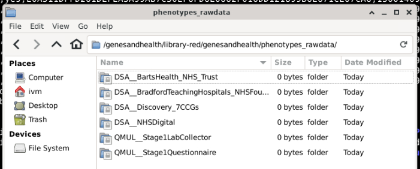

# Sources of "raw" health data

This page provides an overview of the "raw" health data available to Genes and Health TRE users. All files described below (with the exception of NHS Digital data) are located in `library-red`, please see the "[Understanding TRE folders and buckets](../using-the-tre/understanding-tre-folders-and-buckets.md)" section describing the TRE file system for further information.

!!! info
    File paths described below assume you are starting from **`/genesandhealth/library-red/genesandhealth/phenotypes_rawdata/`**.
    

    

All folders contain detailed `README.txt` files, which describe the contents of each data file in more detail (number of rows, number of G&H volunteers present in the file, version info, changes, etc).

## Primary care data

Primary care datasets and linkage are provided by agreement with GP practices, made at the CCG level. As of 2025-09-18 all primary care data are for participants registered with practices in the North East London ICS only. Data are refreshed periodically to add complete historical records for new participants, and to update existing participants' records with information from clinical contacts made since the previous refresh.

### London

All files are located in **`DSA_Discovery_7CCGs`**. Subfolders are created for each data refresh. Folder names are the date of the refresh.

For refreshes before 2023_01 data are further split by Clinical Commissioning Group (CCG):

1. **GNH\_thwfnech** are for volunteers registered at practices in Tower Hamlets, Waltham Forest, Newham, City & Hackney CCGs  
2. **GNH\_bhr** are for volunteers registered at practices in Barking, Havering, Redbridge and outer east London CCGs

**For refreshes after 2023-01 the data for these two regions are combined.**

!!! info 
    As of 2025-09 Genes & Health does not have access to data for volunteers registered with practices in the North West London and South East London CCGs.  With the transition to OneLondon's London Data Service for GP data for research provision, we anticipate access to GP data for all our London registered volunteers. 

#### Data files
Each folder contains the following files, all containing raw, individual level data, with one row per observation.

* **medications\_ord** for normal repeat prescriptions  
    
* **medications\_stmt** for short term medications and treatments  
    
* **observations** for diagnoses, blood test results, clinical measurements, other tests and referrals  
    
* **procedure\_req** for health and medication reviews, screening and vaccination records

All files contain:

* A pseudoNHSnumber for linkage across all health data, and to the Genes and Health OrageneID number.  
    
* SNOMED concept ID for describing diagnoses, procedures, and prescriptions (useful for generating binary traits)  
    
* value results (for test results e.g. creatinine, height etc where applicable and useful for generating quantitative traits)  
    
* value units (where applicable) describing the unit of measurement (e.g. meters or cm for height)  
    
* Clinical effective date (usually when the SNOMED code was entered into the patient record)

### Bradford

No raw primary care data as of 2025-09-18

### Manchester

No raw primary care data as of 2025-09-18

## Secondary care data

At present, secondary care data are split by location. As of 2025-09-18 secondary care data are available for volunteers in London and Bradford.  We also have national-level data from (ex)NHS Digital for our volunteers --these national-level data are derived from both primary and secondary care records.

### **London**

Data provided by the Barts NHS Trust.  All files are located in **`DSA_BartsHealth_NHS_Trust`**. Subfolders are created for each data refresh. Folder names are the date of the refresh. Data are retrieved from the Barts Health Trust Data Warehouse and contain information on visits made by Genes & Health volunteers to hospitals in that Trust only.

The Barts NHS Trust provides multiple datasets that are unique/specific to the trust, including pathology lab data (useful for generating quantitative traits, prescribing data, and radiology department reports. Some datasets are only available by special request (e.g. maternity bookings, chemotherapy prescribing). Please see the `README.txt` in the `DSA_BartsHealth_NHS_Trust folder` for further details.

<!--Data in the icd\_10\_combined\_redacted.txt and opcs\_combined\_redacted.txt files will have substantial overlap with HES (see note above on availability), and are useful for generating [binary traits](https://tre-documentation.pages.dev/docs/explainers/phenotype_curation)-->

### **Bradford**

Data provided by the Bradford Teaching Hospitals NHS foundation trust. All files are located in **`DSA_BradfordTeachingHospitals_NHSFoundation_Trust`**. Subfolders are created for each data refresh. Folder names are the date of the refresh.

### **Manchester**

No raw secondary care data as of 2025-09-02.

## National level data (aka NHS Digital data)

These are datasets provided by the NHS England's former NHS Digital service.

These principally represent [Hospital Episode Statistics (HES)](https://digital.nhs.uk/data-and-information/data-tools-and-services/data-services/hospital-episode-statistics) and [Emergency Care Data Set (ECDS)](https://digital.nhs.uk/data-and-information/data-collections-and-data-sets/data-sets/emergency-care-data-set-ecds) data.  For some years, addtional datasets are available such as IAPT, NDA or MHS data.

!!! warning "Availability of NHS Digital raw data"
    NHS Digital data are obtained by Genes & Health under specific NHS Digital-led sublicense agreements.  Each data using university/project/industry partner (think each sandbox) needs to obtain its own NHS Digital sublicense in order to access the raw NHS Digital data.
    

    For this reason, NHS Digital raw data are stored in a separate GCS bucket: `/genesandhealth/nhsdigital-sublicense-red`.  If your sandbox does not have this GCS bucket, or access to the bucket is denied, this is because there is not an appropriate sublicense agreement in place.  If you think this is incorrect, please contact us at [genesandhealth@qmul.ac.uk](mailto:genesandhealth@qmul.ac.uk).

    !!! info
        Although only G&H TRE users with an appropriate NHS Digital sublicense can access the NHS Digital raw data, output derived from the NHS Digital data are not subject to such restrictions.  For example, NHS Digital data are used in our binary trait and quantitative trait generating pipelines and the output of these pipelines are accessible to all users.

<!--
## What do the raw data look like

This section describes the **raw** phenotype files currently available in the TRE, and their location in the TRE file structure. Column headings are replicated directly, brief summaries of file contents and column contents will be updated.

For most users and use cases, this documment should serve as a reference guide only. Members of the GH data team have used the raw files described here to produce curated products, that will in most cases be more useful (and user friendly).

/genesandhealth/library-red/genesandhealth/phenotypes\_rawdata/DSA\_\_BartsHealth\_NHS\_Trust/2021\_04\_PathologyLab/AntiMullerianHormone\_April2021.csv

| PseudoNHSNo | Age At Test | Test Name | Date of Test | Result | Unit |
| :---- | :---- | :---- | :---- | :---- | :---- |
| Type description here | Type description here | Type description here | Type description here | Type description here | Type description here |
-->
