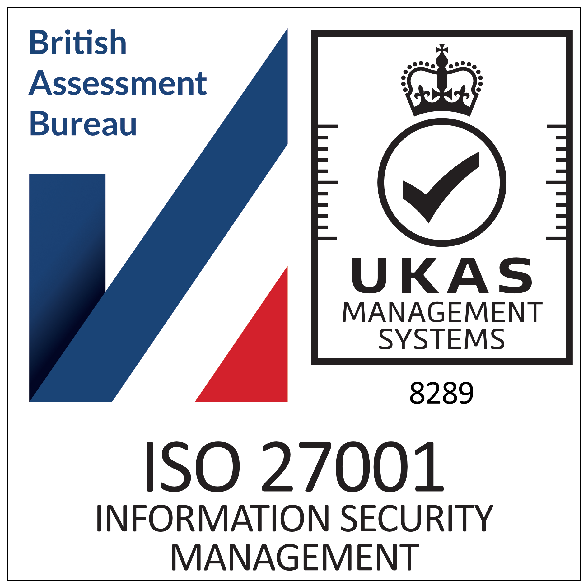

# What is a TRE ?

Many large genetics and health data studies such as Finngen, UK Biobank, Genomics England are using Trusted Research Environments (TREs). Also known as Secure Data Environments. NHS England and Health Data Research UK are strongly supporting this model. 

The essential qualities of a TRE are:

- The TRE restricts access to data inside the TRE to authenticated users, who are given access in a highly controlled manner  
- The TRE doesn’t allow users to export data without inspection from the project’s Data Controller or a delegate.  
- The TRE doesn’t allow users to import code or data without inspection from the project’s Data Controller or a delegate.

That is, researchers must enter the secure environment of a TRE to work on the data inside, and cannot export summary results without inspection, to ensure no sensitive personal data is being exported.

In our case, many NHS Providers will not supply clinical data (including sensitive personal data) for GnH participants unless GnH can house it in an ISO27001-certified TRE.

The Genes & Health TRE is ISO/IEC 27001:2022 certified and NHS Data Security and Protection Toolkit registered.

{ width="250" }

